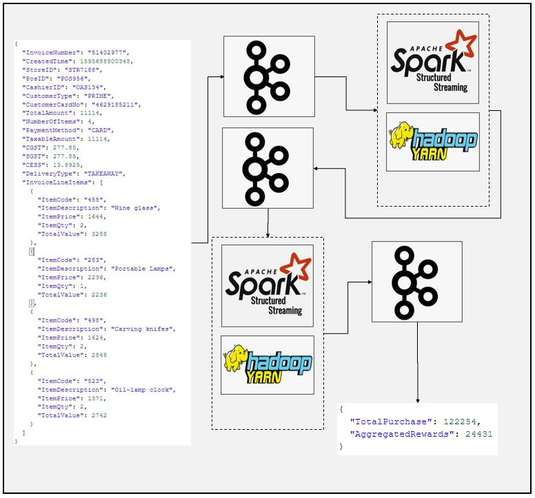

# SparkStream Kafka-Avro to Kafka-Json Transform Example
### Dataflow Pipeline


### Summary

This is kafka-avro source kafka-json sink spark application example. This application depends on another spark applications https://github.com/euguroglu/Spark_Kafka_to_Kafka_Avro Spark_Kafka_to_Kafka_Avro application sends flattaned data to invoice-items topic as avro format. kafka2kafka_avro_notification script reads avro data from kafka source calculate total transaction amount and total loyalty points earned by customer, finally serialize data into json format before sending it to another kafka topics which we can see result using kafka console consumer.

### Task List

Here is avro schema which we are using to deserialize avro data comes from kafka source.

```json
{
  "type": "record",
  "name": "InvoiceItem",
  "namespace": "guru.learningjournal.spark.examples.types",
  "fields": [
    {"name": "InvoiceNumber","type": ["string", "null"]},
    {"name": "CreatedTime","type": ["long", "null"]},
    {"name": "StoreID","type": ["string", "null"]},
    {"name": "PosID","type": ["string", "null"]},
    {"name": "CustomerType","type": ["string", "null"]},
    {"name": "CustomerCardNo","type": ["string", "null"]},
    {"name": "DeliveryType","type": ["string", "null"]},
    {"name": "City","type": ["string", "null"]},
    {"name": "State","type": ["string", "null"]},
    {"name": "PinCode","type": ["string", "null"]},
    {"name": "ItemCode","type": ["string", "null"]},
    {"name": "ItemDescription","type": ["string", "null"]},
    {"name": "ItemPrice","type": ["double", "null"]},
    {"name": "ItemQty","type": ["int", "null"]},
    {"name": "TotalValue","type": ["double", "null"]}
  ]
}

```
### Task List

- [x] Create kafka topic
```
/home/enes/Software/kafka_2.12-2.7.0/bin/kafka-topics.sh --create --zookeeper localhost:2181 --replication-factor 1 --partitions 1 --topic customer-rewards

```
- [x] Create spark session (You can use ".master("local[*])" instead of yarn if you are running Spark on standalone mode")
```
if __name__ == "__main__":
    spark = SparkSession \
        .builder \
        .appName("Multi Query Demo") \
        .master("yarn") \
        .config("spark.streaming.stopGracefullyOnShutdown", "true") \
        .config("spark.sql.shuffle.partitions", 3) \
        .getOrCreate()
```
- [x] Read from kafka
```
kafka_source_df = spark \
    .readStream \
    .format("kafka") \
    .option("kafka.bootstrap.servers", "localhost:9092") \
    .option("subscribe", "invoice-items") \
    .option("startingOffsets", "earliest") \
    .load()

```
- [x] Open avro schema
```
avroSchema = open('schema/invoice-items', mode='r').read()
```
- [x] Deserialize and check schema
```
value_df = kafka_source_df.select(from_avro(col("value"), avroSchema).alias("value"))

value_df.printSchema()
```

- [x] Calculate total transactions and rewards
```
rewards_df = value_df.filter("value.CustomerType == 'PRIME'") \
    .groupBy("value.CustomerCardNo") \
    .agg(sum("value.TotalValue").alias("TotalPurchase"),
         sum(expr("value.TotalValue * 0.2").cast("integer")).alias("AggregatedRewards"))

rewards_df = rewards_df.withColumn("CustomerCardNo", expr("`value.CustomerCardNo`")) \
                       .drop("value.CustomerCardNo")
```
- [x] Apply serialization before sending data to kafka
```
kafka_target_df = rewards_df.select(expr("CustomerCardNo as key"),
                                    to_json(struct("TotalPurchase", "AggregatedRewards")).alias("value"))
```

- [x] Write data into kafka
```
rewards_writer_query = kafka_target_df \
    .writeStream \
    .queryName("Rewards Writer") \
    .format("kafka") \
    .option("kafka.bootstrap.servers", "localhost:9092") \
    .option("topic", "customer-rewards") \
    .outputMode("update") \
    .option("checkpointLocation", "KafkaAvro/chk-point-dir") \
    .start()

rewards_writer_query.awaitTermination()
```

- [x] Create new kafka topic for this application

- [x] Start kafka console consumer

- [x] Check results

### Code Description

kafka2kafka_avro_multi_sparkstream.py is spark script to make desired transformations and write them to the another kafka topic. This is an example to show serialization using avro format. Do not forget to import spark-avro package from maven repository.

### Running

1. Start dependent spark application

https://github.com/euguroglu/Spark_Kafka_to_Kafka_Avro

2. Create kafka topics
```
/home/enes/Software/kafka_2.12-2.7.0/bin/kafka-topics.sh --create --zookeeper localhost:2181 --replication-factor 1 --partitions 1 --topic customer-rewards

```
3. Start spark job
```
spark-submit --packages org.apache.spark:spark-sql-kafka-0-10_2.12:3.1.1,org.apache.spark:spark-avro_2.12:3.1.1 kafka2kafka_avro_notification.py
```
4. Start kafka consumer

5. Check result

```json
{
  "TotalPurchase": 122254,
  "AggregatedRewards": 24431
}
```
